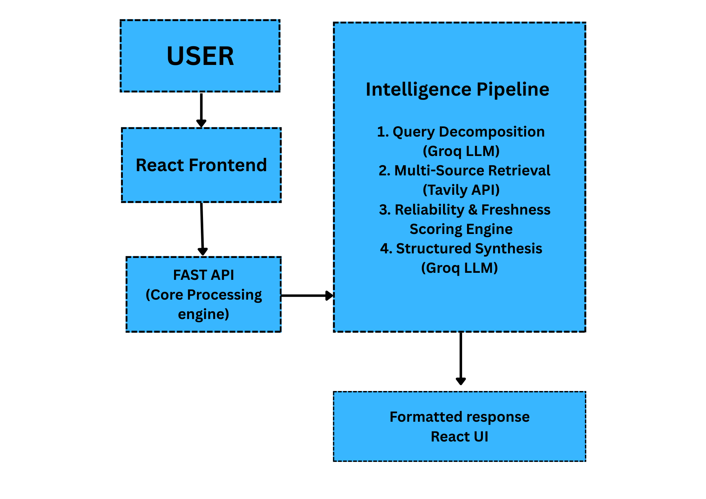

# The-Research-That-Takes-a-Week-and-Shouldn-t

An AI Powered research assistant that transforms complex questions into structured and detailed reports with verified sources.

---

## 1. Problem Statement

### Problem Title
The Research That Takes a Week and Shouldn't

### Problem Description
Despite the abundance of online information, generating reliable research remains a manual and time-consuming task. Professionals have to search through many sources, check if the information is reliable, resolve conflicting data, and turn everything into useful insights. This process is inefficient, inconsistent and difficult to scale. As a result, decisions are often made of incomplete or outdated information. Therefore, an intelligent system that automates the most time-consuming aspects of research while preserving analytical rigor is needed.
### Target Users
- Business Analysts
- Startup Founders
- Product Managers
- Consultants
- VCs

### Existing Gaps
- Traditional search engines return unstructured results that require manual interpretation.
- Evaluating the reliability of each source manually is very time consuming and inconsistent, thereby making the research process slow.
- When some sources provide contradictory data, there is no automated or faster way to compare and resolve these discrepancies.
- Many AI generated summaries cannot be trusted a lot because they don't clearly cite the sources or indicate confidence levels.
- Professionals spend more time gathering information than analyzing it.
- Reports on the internet get outdated quickly, they are do not update in real time.
- Existing tools though assist with summarization but do not generate structured results.

---

## 2. Problem Understanding & Approach

### Root Cause Analysis
- Disconnected information.
- Lack of structured information systems.
- Manual Credibility Assessment.
- No automated conflict resolution.
- Time-Consuming research process.
- Limited Integration between search and AI.

### Solution Strategy
1. Decompose Complex Queries
2. Retrieve Multisource Data
3. Evaluate Credibility and Freshness
4. Structured intelligence synthesis
5. Store and Track Research Outputs

---

## 3. Proposed Solution

### Solution Overview
Autonomous Research intelligence layer to do the task that takes 30-40 hrs into just a few minutes.

### Core Idea
The core idea is to automatically decompose complex user queries into focused sub-questions, retrieve multi-source information, and generate structured, user-friendly intelligence. The system incorporates a reliability and freshness scoring engine to ensure that outputs are transparent, credible, and decision-ready.

### Key Features
- Retrieving Information for multiple sources.
- Credibility and freshness scoring engine.
- Structured intelligence synthesis
- Clean and user friendly response 

---

## 4. System Architecture

### High-Level Flow

  1. User
  2. React Frontend
  3. Fast API Backend (Orchestrator)
  4. Query Decomposition (LLM-Groq)
  5. Multi-Source Retrieval (Tavily API)
  6. Credibility and freshness scoring engine
  7. Structured intelligence synthesis (LLM)
  8. Firebase (Store logs, sources, scores)
  9. Formatted Response to Frontend

### Architecture Description
Users submit complex research queries through the React UI, Which sends requests to FAST API backend acting as central orchestration layer.
The backend first decomposes the query using the Groq-powered LLM to break it into focused sub-questions.These sub-questions are sent to tavily API for multi-source information retrieval.
Retrieved content is evaluated using credibility and freshness scoring engine to assess reliability and freshness.
The refined information is passed back to the LLM for structured intelligence synthesis, generating a decision-ready report with insights, risks and confidence score. All logs, sources and reports are stored in Firebase (Cloud Firestore) for storage. The final structured response is returned in clean and user-friendly format.

### Architecture Diagram

---

## 5. Database Design

### ER Diagram

### ER Diagram Description

## 6. Technology Stack

- Frontend-> React (vite)
- Backend-> Fast API (Python)
- ML/AI-> Groq API (LLM), Tavily API
- Database-> Cloud Firestore
- Deployment-> 

                 

                 

---

## 7. API Documentation & Testing

### API Endpoints List
- Endpoint 1:
- Endpoint 2:
- Endpoint 3:

### API Testing Screenshots
(Add Postman / Thunder Client screenshots here)

---

## 8. Module-wise Development & Deliverables

### Checkpoint 1: Research & Planning
- Deliverables:

### Checkpoint 2: Backend Development
- Deliverables:

### Checkpoint 3: Frontend Development
- Deliverables:

### Checkpoint 4: Model Training
- Deliverables:

### Checkpoint 5: Model Integration
- Deliverables:

### Checkpoint 6: Deployment
- Deliverables:

---

## 9. End-to-End Workflow
- Multi-agent Workflow:
    1. Junior Analyst: Gather info.
    2. Senior Analyst: Critical evaluation.
    3. Strategy Consultant: Structured output.
    4. Risk Officer: Confidence scoring
- Complete Workflow:
  Step :one: User Submits Research Question
  
  Step :two: Query Structuring (LLM – Decomposition Phase)
    Backend calls Groq:
    The model converts the broad question into structured sub-questions:
    
    Market size & growth
    Regulatory environment
    Competitive landscape
    Funding trends
    Risk factors
    This creates a structured research plan.

  Step :three: Real-Time Source Retrieval (Tavily API)
    For each sub-question:
    • Fetch 5–8 relevant, recent sources
    • Extract:
    Title
    URL
    Publication date
    Snippet
    Now the system has raw intelligence signals.

  Step :four: Source Credibility Scoring (Backend Logic)
    Each source is scored based on:
    
    Domain type (.gov / .edu boost)
    Publication recency
    Cross-source agreement
    Media vs blog weighting
    Example output:
    
    Source A → 8.7 / 10
    Source B → 6.1 / 10
    Source C → 4.9 / 10

  Step :five: Freshness Calculation
    System calculates:

    Average publication age
    Weighted recency score
    Generates:
    Data Freshness Index: 91% times this ensures research is not outdated.

  Step :six: Contradiction Detection
    System checks:

    Are sources disagreeing?
    Do some claim growth while others claim decline?
    If yes:

    Identify disagreement
    Compare credibility
    Highlight stronger signal
    This simulates analyst judgment.

  Step :seven: Structured Intelligence Synthesis (LLM)
    Backend sends structured data + scored sources to Groq.
    LLM generates:

    Executive Summary
    Key Findings
    Risks & Uncertainties
    Strategic Implications
    Strict JSON schema enforced.
    No free-form text.

  Step :eight: Confidence Score Calculation
    Final confidence is calculated using:

    Confidence =
    (Source Credibility Average × Agreement Factor × Freshness Factor)Displayed as:
    Overall Intelligence Confidence: 7.8 / 10This is your differentiator.

  Step :nine: Store Results (Firebase)
    Store:
    
    User query
    Retrieved sources
    Scores
    Generated report
    Timestamp
    Enables:
    
    Audit trail
    Report regeneration
    Historical analysis (future scope)

  Step :keycap_ten: Deliver Structured Report to UI
    Frontend renders:

    Executive Summary
    Key Findings
    Risk Section
    Source Table
    Confidence Score
    Freshness Index

  

---

## 10. Demo & Video

- Live Demo Link:
- Demo Video Link:
- GitHub Repository:

---

## 11. Hackathon Deliverables Summary

-
-
-
-

---

## 12. Team Roles & Responsibilities

| Member Name | Role | Responsibilities |
|-------------|------|-----------------|
| Jash Sanka  |Frontend| UI |
| Abhinav Amrute | Backend | Backend|
|Pallav Dholariya | Logic & Workflow | --|

---

## 13. Future Scope & Scalability

### Short-Term
-

### Long-Term
-

---

## 14. Known Limitations

-
-
-

---

## 15. Impact

-
-
-

